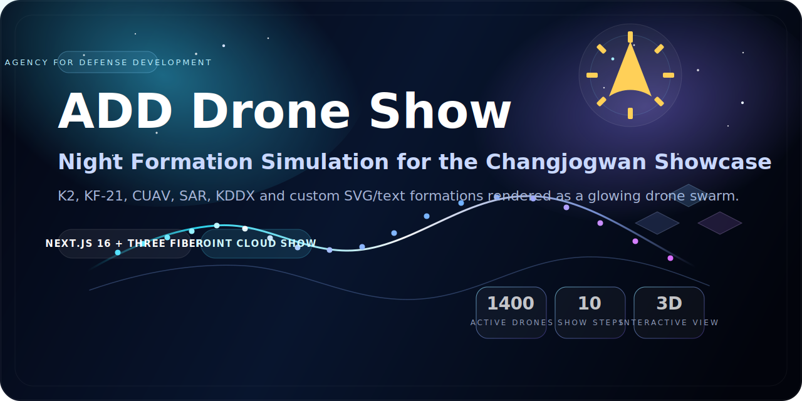
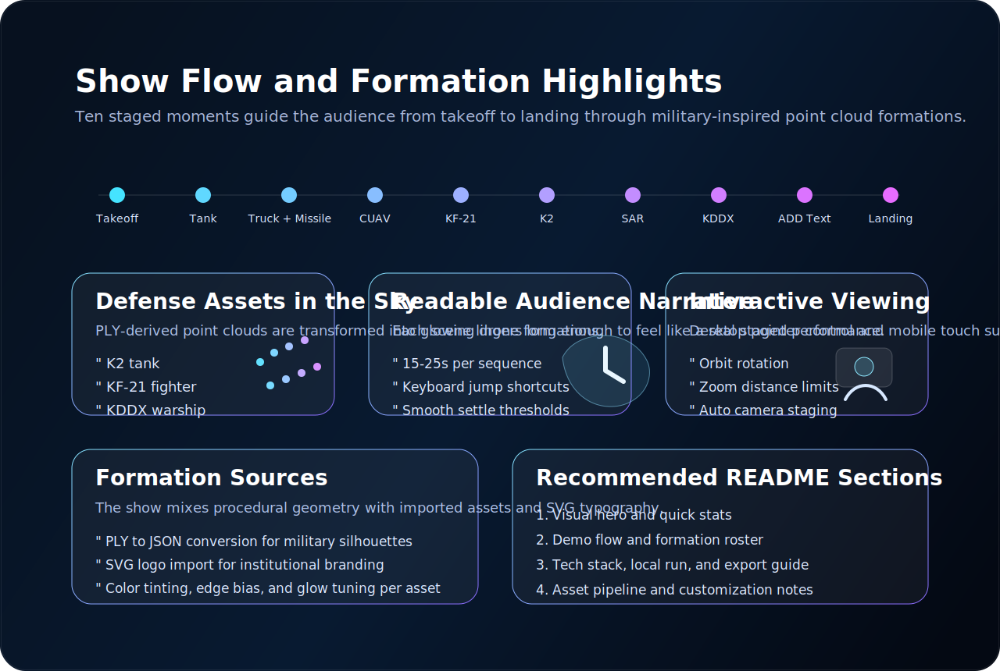
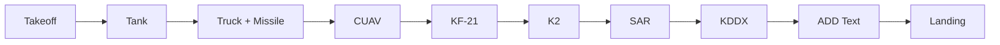

# ADD Drone Show Simulation

<p align="center">
  
</p>

<p align="center">
  국방과학연구소(ADD) 위한 <b>야간 드론쇼 시뮬레이션 웹 프로젝트</b><br/>
  군 장비 실루엣, 기관 로고, 텍스트 연출을 <b>3D 포인트 클라우드 드론 군집</b>으로 재구성합니다.
</p>

<p align="center">
  
  
  
  
</p>

## Overview
이 프로젝트는 `Next.js 16`, `React 19`, `Three.js`, `@react-three/fiber`를 기반으로 구축된 인터랙티브 드론쇼 시뮬레이터입니다.  
실제 장비 형상(`K2`, `KF-21`, `KDDX`, `CUAV`, `SAR`)과 기관 로고를 포인트 클라우드로 변환해, 밤하늘 위 드론 군집처럼 발광하는 연출을 구현합니다.

## Visual Highlights

| Highlight | Description |
| --- | --- |
| `1400` active drones | 메인 쇼 연출에 사용하는 고밀도 드론 포인트 수 |
| `10` staged steps | 이륙부터 착륙까지 이어지는 연속 시퀀스 |
| `PLY + SVG + JSON` pipeline | 3D 자산과 로고/텍스트를 드론 포메이션으로 변환 |
| `Interactive camera` | 마우스/터치 기반 회전, 줌, 시점 탐색 지원 |

<p align="center">
  
</p>

## Show Sequence



## Formation Roster

| Step | Formation | Source |
| --- | --- | --- |
| 01 | `직육면체 이륙` | 기본 군집 배열 |
| 02 | `K9 자주포` | PLY 기반 포인트 클라우드 |
| 03 | `트럭 + 미사일` | 복합 장면 조합 |
| 04 | `CUAV` | PLY 기반 포인트 클라우드 |
| 05 | `KF-21` | PLY 기반 포인트 클라우드 |
| 06 | `K2 전차` | PLY 기반 포인트 클라우드 |
| 07 | `SAR 위성` | PLY 기반 포인트 클라우드 |
| 08 | `KDDX` | PLY 기반 포인트 클라우드 |
| 09 | `국방과학연구소` | `logo.svg` + 텍스트 조합 |
| 10 | `착륙` | 지면 복귀 애니메이션 |

## Feature Set

- 고밀도 포인트 클라우드 드론 렌더링
- 자산별 색상 보정, glow, edge bias 튜닝
- 단계별 정착 시간과 전환 타이밍 제어
- 숫자 키 입력으로 시퀀스 점프 지원
- 모바일 터치와 데스크톱 포인터 입력 지원
- 기관 로고와 텍스트를 SVG 기반 형상으로 변환
- 정적 export 결과물 생성 가능

## Tech Stack

| Layer | Tools |
| --- | --- |
| Framework | `Next.js 16`, `React 19`, `TypeScript` |
| 3D Rendering | `three`, `@react-three/fiber`, `@react-three/drei` |
| Effects | `@react-three/postprocessing`, bloom/glow tuning |
| Styling | `Tailwind CSS 4` |
| Asset Utils | `pngjs`, custom `imageToPoints`, `svgToPoints` |

## Getting Started

```bash
npm install
npm run dev
```

브라우저에서 `http://localhost:3000`을 열면 랜딩 페이지가 보이고, 진입 후 `/show`에서 전체 드론쇼를 확인할 수 있습니다.

## Build

```bash
npm run build
```

정적 결과물은 `out/` 디렉터리에 생성되며, 정적 호스팅 환경에 그대로 배포할 수 있습니다.

## Project Structure

```text
src/
  app/
    page.tsx                 # 랜딩 페이지
    show/page.tsx            # 쇼 진입 페이지
  components/
    DroneShowCanvas.jsx      # 핵심 포인트 클라우드 시뮬레이션
    Scene.jsx                # 씬 래퍼 및 HUD
    UIOverlay.tsx            # 오버레이 UI
  utils/
    imageToPoints.js         # 이미지/포인트 클라우드 보정
    svgToPoints.js           # SVG -> 드론 포인트 변환
    formations.ts            # 절차형 포메이션 생성
public/
  formations/
    generated/*.json         # 장비/오브젝트 포인트 클라우드 데이터
    logo.svg                 # 기관 로고 자산
```

## Asset Pipeline

1. 원본 `PLY` 또는 `SVG` 자산을 포인트 데이터로 변환합니다.
2. 장면에 맞는 `scale`, `rotate`, `translate` 값을 적용합니다.
3. `fitPointCloud()`로 목표 드론 수와 화면 구도에 맞게 재배치합니다.
4. 스텝 전환 시 현재 포메이션에서 다음 포메이션으로 보간합니다.

## Customization Ideas

- 새로운 장비 `PLY`를 `public/formations/generated`로 추가
- 기관/행사 로고를 `SVG`로 교체해 커스텀 브랜딩 구성
- `STEPS`와 duration 값을 조정해 연출 길이 재설계
- 카메라 제약값과 glow 값을 바꿔 더 극적인 무드 연출
